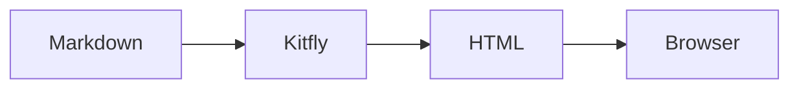
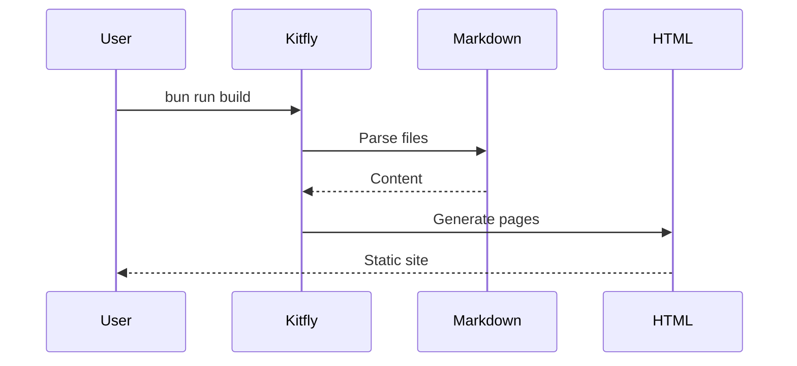

# Features

Everything kitfly supports, demonstrated on this page.

## Code Highlighting

Syntax highlighting via Prism.js (loaded from CDN):

```javascript
function greet(name) {
  return `Hello, ${name}!`;
}

console.log(greet("World"));
```

```python
def greet(name: str) -> str:
    return f"Hello, {name}!"

print(greet("World"))
```

```yaml
site:
  title: "My Documentation"
  theme: "auto"
```

## Mermaid Diagrams

Flowcharts, sequence diagrams, and more:





## Tables

Standard markdown tables with clean styling:

| Feature | Status | Notes |
|---------|--------|-------|
| Hot reload | ✅ | Instant updates |
| Dark mode | ✅ | System preference |
| TOC | ✅ | Auto-generated |
| Search | 🚧 | Coming soon |

## Text Formatting

Standard markdown formatting:

- **Bold text** for emphasis
- *Italic text* for nuance
- `inline code` for technical terms
- ~~Strikethrough~~ for corrections

> Blockquotes for callouts and important notes.
> They can span multiple lines.

## Links

- [Internal link to Getting Started](getting-started.html)
- [External link to Bun](https://bun.sh)
- [Reference to Configuration](../reference/configuration.html)

## Lists

Ordered:

1. First item
2. Second item
3. Third item

Unordered:

- Item one
- Item two
  - Nested item
  - Another nested
- Item three

## Images

Standard markdown images are supported across all output modes:

```markdown

```

In `kitfly dev` and `kitfly build`, images are served from their original paths. In `kitfly bundle`, images are automatically inlined as base64 data URIs so the single-file HTML works fully offline with no broken references.

## Headings

This page demonstrates h1 through h3. The table of contents on the right is auto-generated from h2 and h3 headings.

### This is an h3

Use h3 for subsections within a topic.

### Another h3

The TOC captures these too.
